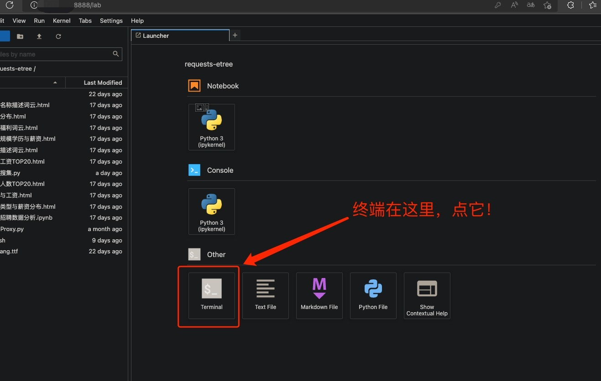
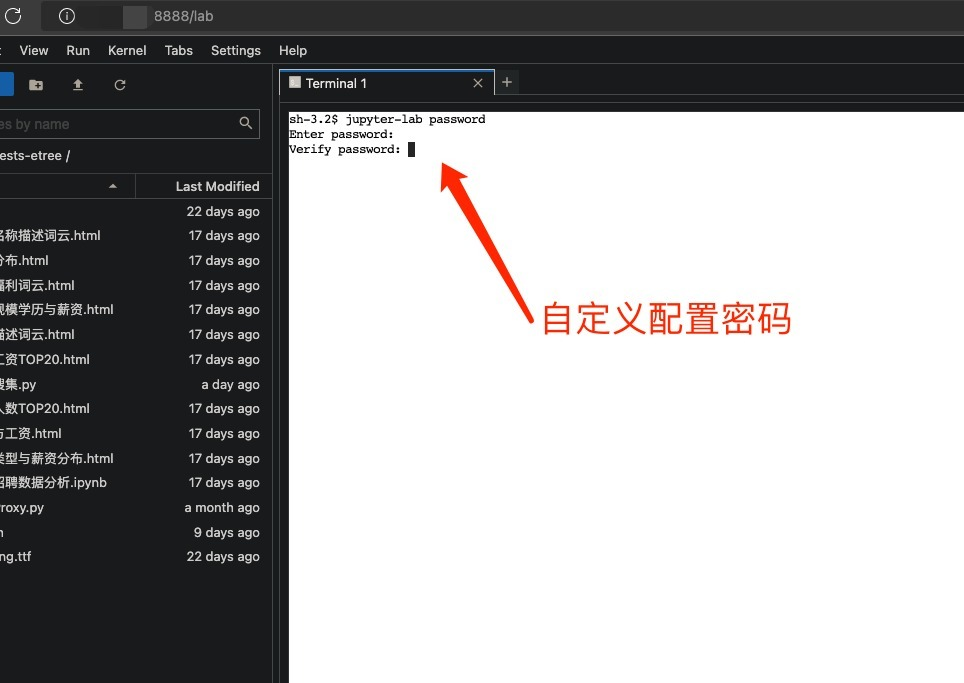

# docker-arch-miniforge-jupyter
在 arm64v8 和 amd64 ubuntu上使用的 miniforge Jupyter docker构建材料

    
<a href="https://star-history.com/#20241204/docker-arch-miniforge-jupyter&Date">
  <picture>
    <source media="(prefers-color-scheme: dark)" srcset="https://api.star-history.com/svg?repos=20241204/docker-arch-miniforge-jupyter&type=Date&theme=dark" />
    <source media="(prefers-color-scheme: light)" srcset="https://api.star-history.com/svg?repos=20241204/docker-arch-miniforge-jupyter&type=Date" />
    
  </picture>
</a>

## ghcr.io
镜像仓库链接：[https://github.com/20241204/docker-arch-miniforge-jupyter/pkgs/container/docker-arch-miniforge-jupyter](https://github.com/20241204/docker-arch-miniforge-jupyter/pkgs/container/docker-arch-miniforge-jupyter)  

## 描述
1.为了实现 actions workflow 自动化 docker 构建运行，需要添加 `GITHUB_TOKEN` 环境变量，这个是访问 GitHub API 的令牌，可以在 GitHub 主页，点击个人头像，Settings -> Developer settings -> Personal access tokens -> Tokens (classic) -> Generate new token -> Generate new token (classic) ，设置名字为 GITHUB_TOKEN 接着要配置 环境变量有效时间，勾选环境变量作用域 repo write:packages workflow 和 admin:repo_hook 即可，最后点击Generate token，如图所示

  

2.赋予 actions[bot] 读/写仓库权限，在仓库中点击 Settings -> Actions -> General -> Workflow Permissions -> Read and write permissions -> save，如图所示

3.转到 Actions  

    -> Clean Git Large Files 并且启动 workflow，实现自动化清理 .git 目录大文件记录  
    -> Docker Image Build and Deploy Images to GHCR CI 并且启动 workflow，实现自动化构建镜像并推送云端  
    -> Remove Old Workflow Runs 并且启动 workflow，实现自动化清理 workflow 并保留最后三个    
    
4.这是包含了 miniforge 和 jupyter 的 docker 构建材料  
5.主要目的是为了使用 jupyter 本来没想这么复杂，我就是觉得 miniforge 好，为了自己的追求，只能辛苦一下  
6.以下是思路：    
  * 安装 miniforge 环境并安装 jupyter 然后维持其运行，这样容器就不会自己停止，实在太慢，我都哭了 >_<  

7.目录结构：  

    .                                                      # 这个是根目录
    ├── .github                                            # 这个是github虚拟机项目
    │   └── workflows                                      # 这个是工作流文件夹
    │       ├── actions.yml                                # 这个是docker构建编译流文件
    │       ├── clean-git-large-files.yml                  # 这个是清理 .git 大文件流文件
    │       └── remove-old-workflow.yml                    # 这个是移除缓存流文件                                                      
    ├── Dockerfile                                         # 这个是 构建 miniforge+jupyter 的 Dockerfile 配置文件  
    ├── README.md                                          # 这个是 描述 文件  
    ├── docker-compose-amd64.yml                           # 这个是构建 miniforge+jupyter amd64 的 docker-compose.yml 配置文件  
    ├── docker-compose-arm64.yml                           # 这个是构建 miniforge+jupyter arm64 的 docker-compose.yml 配置文件  
    ├── package                                            # 这个是构建 miniforge+jupyter 的脚本文件材料所在目录   
    │   ├── install.sh                                     # 这个是构建 miniforge+jupyter 镜像的时候在容器内执行流程的脚本   
    │   └── run_jupyter                                    # 这个是启动 jupyter 的脚本无密码环境，第一次执行初始密码123456    
    └── arch_switch.sh                                     # 这个是 actions 所需要的切换脚本用于切换 aarch64 和 x86_64 架构编译  

## 构建命令
### 构建
    # clone 项目
    git clone https://github.com/20241204/docker-arch-miniforge-jupyter
    
    # 进入目录
    cd docker-arch-miniforge-jupyter/
    
    # 无缓存构建
    ## arm64
    docker build --no-cache --platform "linux/arm64/v8" -f Dockerfile -t ghcr.io/20241204/docker-arch-miniforge-jupyter:latest . ; docker builder prune -fa ; docker rmi $(docker images -qaf dangling=true)  
    ## amd64
    docker build --no-cache --platform "linux/amd64" -f Dockerfile -t ghcr.io/20241204/docker-arch-miniforge-jupyter:latest . ; docker builder prune -fa ; docker rmi $(docker images -qaf dangling=true)  
    # 或者这么构建也可以二选一
    ## arm64
    docker-compose -f docker-compose-arm64.yml build --no-cache ; docker builder prune -fa ; docker rmi $(docker images -qaf dangling=true)
    ## amd64
    docker-compose -f docker-compose-amd64.yml build --no-cache ; docker builder prune -fa ; docker rmi $(docker images -qaf dangling=true)
    
    # 构建完成后修改 docker-compose.yml 后启动享用，默认密码 123456
    # 初始密码修改环境变量字段 PASSWORD 详细请看 docker-compose.yml
    # 端口默认 8888
    ## arm64
    docker-compose -f docker-compose-arm64.yml up -d --force-recreate
    ## amd64
    docker-compose -f docker-compose-amd64.yml up -d --force-recreate
    # 也可以查看日志看看有没有问题 ,如果失败了就再重新尝试看看只要最后不报错就好 
    ## arm64
    docker-compose -f docker-compose-arm64.yml logs -f
    ## amd64
    docker-compose -f docker-compose-amd64.yml logs -f

## 默认密码以及修改
    # 别担心我料到这一点了，毕竟我自己还要用呢
    # 首先访问 http://[主机IP]:8888 输入默认密码 123456
    # 然后如图打开终端 在终端内执行密码修改指令 需输入两次 密码不会显示属于正常现象 密码配置文件会保存到容器内的 $HOME/.jupyter/jupyter_server_config.json 
    jupyter-lab password
  
  

## 修改新增
    # 将在线克隆的方式注释了，太卡了，卡哭我了，哭了一晚上 >_< 呜呜呜
    # actions 自动切换 aarch64 或 x86_64 编译
    # 已经将树莓派4B卖了，性能还是不够用
    # 可是项目不管也不行，索性用 github 自带 action 构建镜像提交到 ghcr.io 仓库即时更新镜像

## 缺陷
    1. 本项耦合度极高，主要是将构建流程以及安装部署流程转为自动化脚本，维护成本极高
      哪天我患上了老年痴呆，这个项目得废，且用且珍惜

## 声明
本项目仅作学习交流使用，用于查找资料，学习知识，不做任何违法行为。所有资源均来自互联网，仅供大家交流学习使用，出现违法问题概不负责。

## 感谢&参考
tonistiigi/binfmt: [https://github.com/tonistiigi/binfmt](https://github.com/tonistiigi/binfmt)  
conda-forge：[https://github.com/conda-forge/miniforge](https://github.com/conda-forge/miniforge)  
jupyter：[https://jupyter.org/install](https://jupyter.org/install)   
install jupyter-lab：[https://jupyterlab.readthedocs.io/en/latest/getting_started/installation.html](https://jupyterlab.readthedocs.io/en/latest/getting_started/installation.html)  
Common Extension Points：[https://jupyterlab.readthedocs.io/en/latest/extension/extension_points.html](https://jupyterlab.readthedocs.io/en/latest/extension/extension_points.html)  
jupyter-java：[https://github.com/jupyter-java](https://github.com/jupyter-java)  
